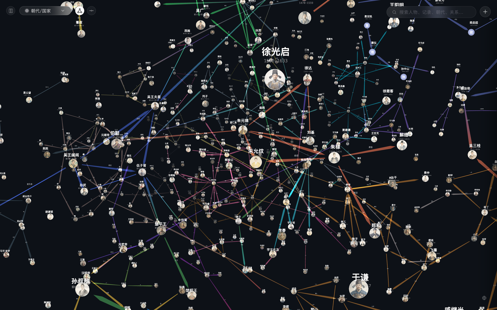
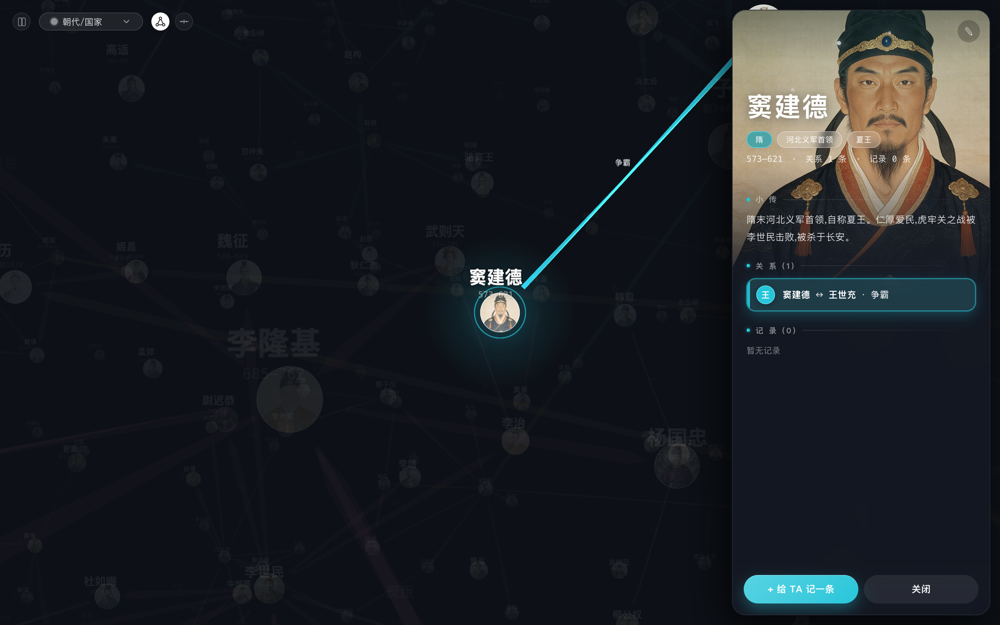
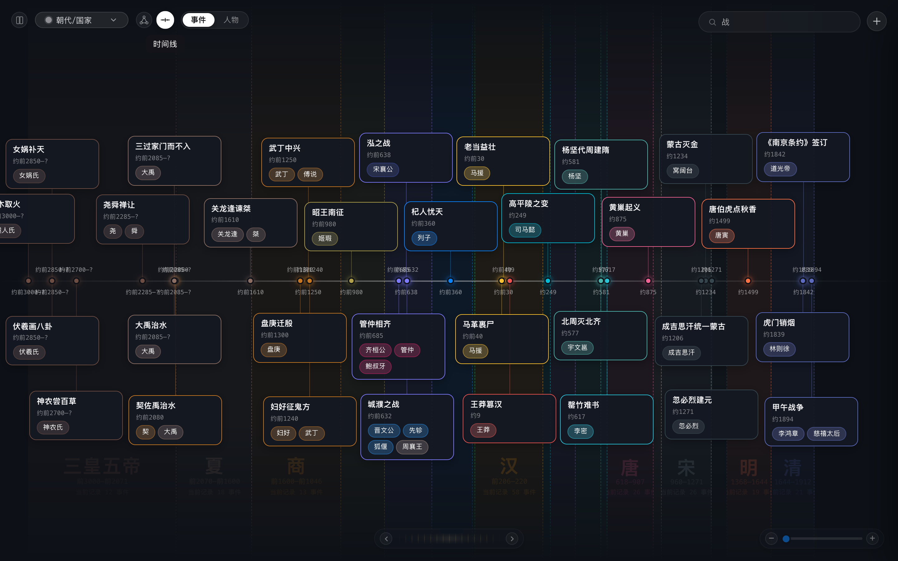
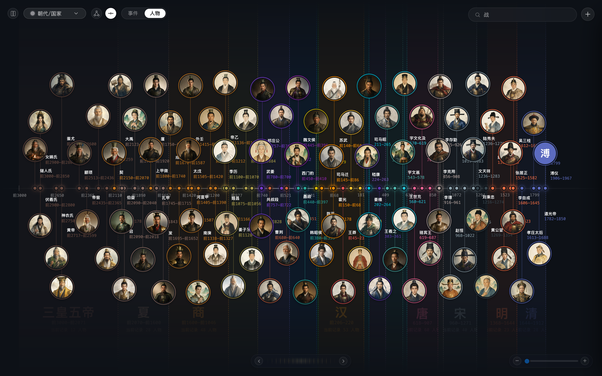
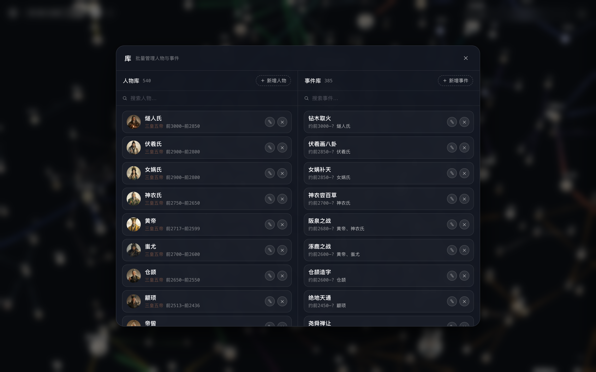
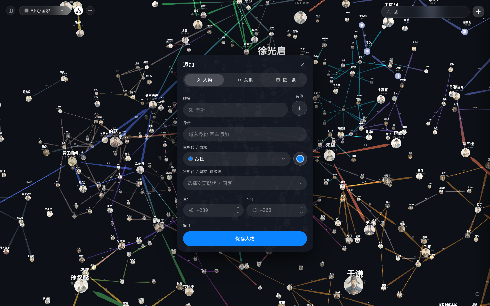
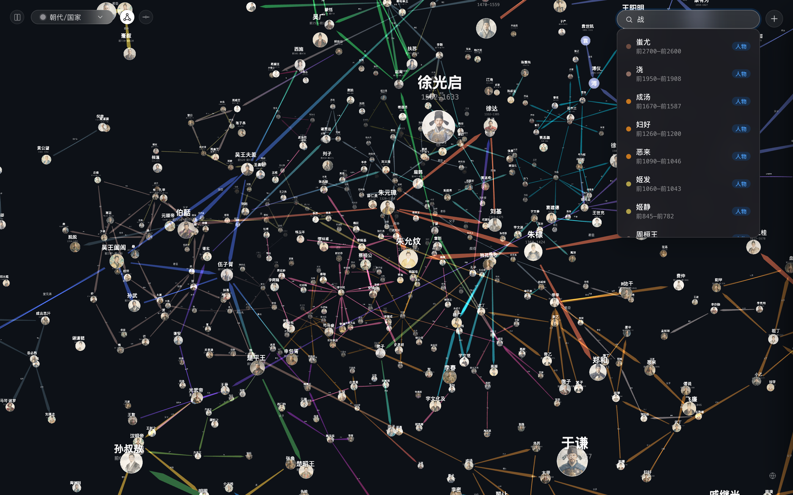

<h1 align="center">人物志 · Chronicle</h1>

<p align="center">
  <strong>本地优先</strong>的历史人物 · 事件 · 关系记录应用<br>
  边听历史边随手记录，再放进一条<b>时间线</b>和一张<b>3D 关系网</b>里，把零散的知识织成脉络。
</p>

<p align="center">
  
</p>

---

> **人物志** 是一款 macOS 桌面应用。听历史播客、看书时，随手记下人物、事件和人物之间的关系，然后用一张可旋转缩放的 3D 关系网和一条按真实年份排列的时间线，把它们串起来看。

## ✨ 功能特性

- 🕸️ **3D 关系网** —— Three.js 渲染的深色宇宙，拖拽旋转、滚轮缩放、悬停高亮，点击节点聚焦人物并高亮其一度关系。
- ⟶ **时间线** —— 按真实年份定位事件；事件密集处放大后自动展开为可标注年份的区间，逐个容纳事件；支持「事件 / 人物」两种模式。
- 👤 **人物抽屉** —— 点击任意人物，右侧滑出详情：生卒年、简介、身份、全部事件与关系，关系可在关系网中一键高亮。
- 📚 **人物库 / 事件库** —— 集中管理，支持批量增删改与朝代 / 关键字筛选。
- ➕ **快速录入** —— 人物 / 关系 / 事件三类；朝代分「主」（决定颜色）与「次」（补充归属）；年份用 `~` 前缀表示约略。
- 🔍 **全局搜索** —— `⌘K` / `Ctrl+K` 搜人物、事件、朝代、关系，带最近搜索历史。
- 🎨 **朝代配色** —— 内置朝代 + 自定义朝代/国家，可按朝代点亮/熄灭，关系网与时间线联动筛选。

## 🖼️ 界面一览

<table>
  <tr>
    <td align="center"><br/>👤 人物抽屉：生平 + 事件 + 关系</td>
    <td align="center"><br/>⟶ 时间线 · 事件模式</td>
  </tr>
  <tr>
    <td align="center"><br/>⟶ 时间线 · 人物模式</td>
    <td align="center"><br/>📚 人物库 / 事件库</td>
  </tr>
  <tr>
    <td align="center"><br/>➕ 添加人物 / 关系 / 事件</td>
    <td align="center"><br/>🔍 全局搜索</td>
  </tr>
</table>

## 🛠 技术栈

| 层 | 技术 |
|---|---|
| 前端 | Nuxt 3 · TypeScript · Three.js（3D 关系网） |
| 后端 | FastAPI · SQLAlchemy · SQLite（数据存本地） |
| 桌面端 | Electron 外壳 + PyInstaller 打包的独立后端，双击即用，无需装 Python / Node |

## 🚀 快速开始

### 方式 A：桌面 App（推荐，无需任何环境）

1. 从 [GitHub Releases](../../releases) 下载 `Chronicle-*-arm64.dmg`，双击挂载，把 `人物志.app` 拖进「应用程序」。
2. 点击图标直接打开，和普通 macOS 软件一样。

> **两点说明**
> - **未签名**：App 未做 Apple 公证，首次打开会提示「无法验证开发者」，需**右键 App → 打开 → 再点打开**（每台电脑一次）。
> - **仅 Apple Silicon**：当前只打 arm64 包，支持 M1/M2/M3/M4；Intel Mac 需另行构建 x64 版。

数据保存在 `~/Library/Application Support/chronicle-desktop/sqlite/chronicle.db`，**与源码目录无关**，升级、重装 App 都不丢数据。

### 方式 B：源码运行（开发）

后端依赖**完全隔离**在 `backend/.venv` 中，绝不装进系统 Python。

```bash
# 首次：创建虚拟环境并安装依赖
cd backend
uv venv .venv
uv pip install --python .venv/bin/python -r requirements.txt
# 没有 uv 时：python3 -m venv .venv && .venv/bin/pip install -r requirements.txt

# 启动后端（监听 http://127.0.0.1:8000，API 文档在 /docs）
.venv/bin/python app/main.py
```

```bash
# 另开终端：启动前端
cd fronted_Nuxt
npm install
npm run dev   # http://localhost:3000
```

前端通过 `useBackendApi` 统一请求，`nuxt.config.ts` 里的 dev proxy 把 `/api/**` 转发到后端。

<details>
<summary>后端不在 8000 端口 / 直连模式</summary>

```bash
# 后端换端口
CHRONICLE_PORT=8001 .venv/bin/python app/main.py

# 前端指向新后端
CHRONICLE_BACKEND_ORIGIN=http://127.0.0.1:8001 npm run dev
# 或直连（后端已开 CORS 允许 localhost:3000）
NUXT_PUBLIC_API_BASE=http://127.0.0.1:8001/api npm run dev
```

</details>

## 🖱️ 操作速览

- **切换视图**：左侧竖向栏（🕸 关系网 / ⟶ 时间线）。
- **关系网**：拖拽旋转、滚轮缩放、悬停高亮、点击打开人物抽屉；左上角为朝代颜色图例。
- **时间线**：横向滚轴，事件卡片上下交错；点击朝代块平滑聚焦该段；右下角 ◍ 查看朝代色卡。
- **库**：左上角「书册」按钮，批量管理人物库与事件库。
- **添加**：右下角「+」，录入人物 / 关系 / 事件。
- **搜索**：右上角搜索框，或 `⌘K` / `Ctrl+K` 聚焦。
- **退出**：`Esc` 关闭抽屉 / 浮卡 / 面板。

## 🧑‍💻 开发者文档

### 后端 API

前缀 `/api/v1`，返回 JSON（年份用整数，负数 = 公元前）。

| 方法 | 路径 | 说明 |
|---|---|---|
| GET / POST | `/persons` | 人物列表 / 新建 |
| GET / PUT / DELETE | `/persons/{id}` | 单个人物 |
| GET | `/persons/{id}/detail` | 人物 + 其全部事件 + 其全部关系（供抽屉） |
| GET / POST | `/events` | 事件列表 / 新建 |
| GET / PUT / DELETE | `/events/{id}` | 单个事件 |
| GET | `/events/timeline?from=&to=` | 时间线数据（按 `year_start` 排序） |
| GET / POST | `/relations` | 关系列表 / 新建 |
| DELETE | `/relations/{id}` | 删除关系 |
| GET | `/graph` | 关系网数据 `{nodes, edges}` |
| GET / POST | `/custom-dynasties` | 自定义朝代/国家列表 / 新建 |
| PUT / DELETE | `/custom-dynasties/{id}` | 编辑 / 删除自定义朝代 |
| GET | `/avatars` | 默认头像库列表 |
| GET | `/avatars/file/{name}` | 按人物名取默认头像图片 |

### 数据模型（SQLite）

| 表 | 字段 |
|---|---|
| `persons` | id, name, dynasty, secondary_dynasties(JSON), birth_year, death_year, summary, identity, color, avatar |
| `events` | id, title, description, year_start, year_end, year_approx(约略年份), dynasty, location |
| `event_persons` | id, event_id, person_id, role(如"主将/主谋/被害") |
| `relations` | id, from_person_id, to_person_id, label, directed(是否单向) |
| `custom_dynasties` | id, name, color |

### 目录结构

```
project-root/
├── backend/                     # FastAPI 后端
│   ├── requirements.txt
│   ├── run.py                   # PyInstaller 打包入口
│   ├── local_data/              # 运行时数据（sqlite 不入库）
│   └── app/                     # 入口 / 模型 / CRUD / 服务 / API
├── fronted_Nuxt/                # Nuxt 3 前端
│   ├── composables/             # useBackendApi / usePersons / useEvents / ...
│   ├── components/              # GraphView / TimelineView / PersonDrawer / ...
│   ├── pages/index.vue          # 单页：内部切换 graph / timeline
│   └── utils/dynasty.ts         # 朝代配色 / 年份格式化
├── desktop/                     # Electron 桌面端外壳
├── docs/                        # 截图与演示素材
└── scripts/build-app.sh         # 一键打包脚本
```

### 打包桌面 App

一键脚本完成「前端静态构建 → 后端 PyInstaller 打包 → Electron 打包」三步：

```bash
./scripts/build-app.sh
```

产物在 `desktop/dist/`：

- `mac-arm64/人物志.app` — 直接可用的 App
- `Chronicle-${版本}-arm64.dmg` — 分发用安装镜像
- `Chronicle-${版本}-arm64.zip` — 免安装压缩包

> **环境完全隔离**：后端由 PyInstaller 打包为独立可执行文件（含 Python 运行时），前端打包为静态文件塞进后端；Electron / electron-builder 装在 `desktop/node_modules`（本地）。全程不写系统 Python、不做全局 npm 安装。

发布时把 `.dmg` 上传到 **GitHub Releases**（单文件最大 2GB），不要直接 commit 进仓库。想让别人「双击即开、零提示」，需用 Apple Developer ID（$99/年）签名 + 公证。

---

<p align="center">
  <sub>数据只存本地 · 无云 · 无账号 · 你的历史笔记属于你</sub>
</p>
